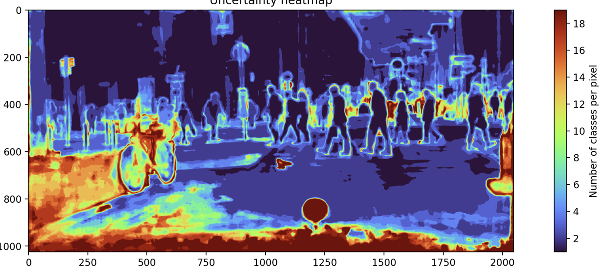

# CV_PR11_road_obstacle_identification



## Abstract

Reliable road obstacle identification is a critical requirement for the safe operation of autonomous driving systems. Traditional object detection methods often struggle to recognize unexpected or unknown obstacles, as they are typically limited to predefined categories. The ability to detect obstacles beyond known classes, particularly in dynamic and complex environments, is essential for the safety of autonomous vehicles. Recent advancements in semantic segmentation, anomaly detection, and uncertainty quantification offer new avenues to improve detection accuracy and reliability, enabling systems to recognize both known and unknown road obstacles. Such uncertainty-aware methods provide formal statistical guarantees on the reliability of predictions, a crucial aspect for ensuring safe and robust decision-making in real-world driving conditions

## Task

The aim of this project is to develop a general, model-agnostic framework for road obstacle identification, starting from the outputs of any semantic segmentation network. The system will focus on anomaly-aware semantic segmentation to detect obstacles outside the predefined classes. This will allow for the identification of unknown obstacles as part of the segmentation output. To ensure that each identification is accompanied by a reliable measure of confidence, the framework will integrate uncertainty quantification through Conformal Prediction methods. By combining these components, the system will not only recognize potential obstacles but also provide formal statistical guarantees regarding the reliability of its predictions.


## Run Experiments

*   ```sh python train.py --model MyNetwork --dataset CSF512x192_OH --log_dir MyNet --epochs 3 --benchmark Obstacles```

## Project Links

* [Google Drive](https://drive.google.com/drive/folders/1v5ReEkvZz2Ztikob-fOPOXxqr4hAw8c5?usp=sharing)
* [Notion](https://www.notion.so/PR11-Uncertainty-Aware-Road-Obstacle-Identification-1ed162539edf80dd917dd24f1e090800?pvs=4)
* [Datasets](https://www.kaggle.com/datasets/shuvoalok/cityscapes)
